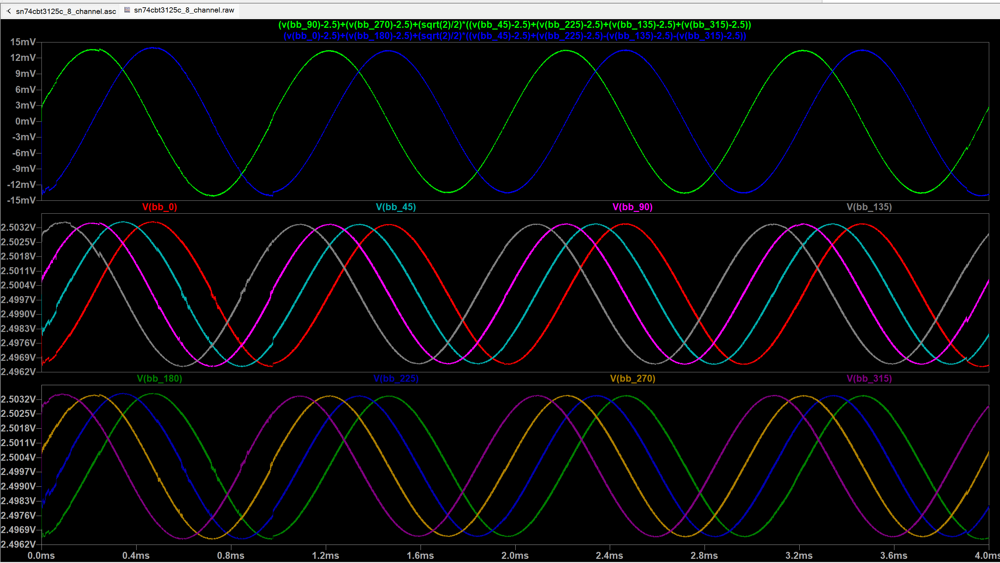

# RX Mixer

This document describes the receive mixer sheet implemented in `nzif/rx_mixer.kicad_sch`.

## What this circuit is

The RX mixer is an **8-phase commutating (switching) zero-IF front end** that takes a differential RF input (`RF+`, `RF-`) and produces eight phase-related baseband channels:

- `BB_0`
- `BB_45`
- `BB_90`
- `BB_135`
- `BB_180`
- `BB_225`
- `BB_270`
- `BB_315`

The commutation timing is driven by eight external phase-control lines:

- `phase_0`, `phase_45`, `phase_90`, `phase_135`
- `phase_180`, `phase_225`, `phase_270`, `phase_315`

## Main building blocks

### 1) Passive switching mixer core

The core switching network is built from four bus-switch ICs:

- `U107`, `U108`, `U112`, `U113`
- Symbol/library: `SN74CBT3125CPW` (value shown as `SN74CBT355CPW`)

These FET switch arrays commutate the RF differential input onto phase-tagged baseband sampling nodes (`Baseband_0` through `Baseband_315`) under control of the `phase_*` signals.

From the schematic image, each IC generates two baseband phase nodes (with switch sections effectively paired per node):

- `U107` -> `Baseband_0`, `Baseband_90`
- `U108` -> `Baseband_45`, `Baseband_135`
- `U112` -> `Baseband_180`, `Baseband_225`
- `U113` -> `Baseband_270`, `Baseband_315`

Per-node commutation relationships shown on the sheet:

- `Baseband_0`: (`phase_0` with `RF+`) and (`phase_180` with `RF-`)
- `Baseband_45`: (`phase_45` with `RF+`) and (`phase_225` with `RF-`)
- `Baseband_90`: (`phase_90` with `RF+`) and (`phase_270` with `RF-`)
- `Baseband_135`: (`phase_135` with `RF+`) and (`phase_315` with `RF-`)
- `Baseband_180`: (`phase_180` with `RF+`) and (`phase_0` with `RF-`)
- `Baseband_225`: (`phase_225` with `RF+`) and (`phase_45` with `RF-`)
- `Baseband_270`: (`phase_270` with `RF+`) and (`phase_90` with `RF-`)
- `Baseband_315`: (`phase_315` with `RF+`) and (`phase_135` with `RF-`)

### 2) Baseband buffering/conditioning

Baseband nodes are sent to op-amp stages implemented with ADA4625 devices:

- `U101`..`U106`, `U109`..`U111`, `U114`..`U116`
- Device: `ADA4625-2ARDZ`

In the drawn configuration, these are **unity-gain voltage followers** (output tied to inverting input), used to buffer each `Baseband_*` node into the corresponding output channel:

- `Baseband_0` -> `BB_0`
- `Baseband_45` -> `BB_45`
- `Baseband_90` -> `BB_90`
- `Baseband_135` -> `BB_135`
- `Baseband_180` -> `BB_180`
- `Baseband_225` -> `BB_225`
- `Baseband_270` -> `BB_270`
- `Baseband_315` -> `BB_315`

### 3) Decoupling and local supply support

The sheet is powered from `5V` and includes local bypassing:

- Bulk/local caps (`C102`, `C105`, `C106`, `C107`) = `10u`
- High-frequency bypass caps (`C101`, `C103`, `C104`, `C108`) = `0.1u`
- Additional per-phase/local decouplers (`HC_101`..`HC_108`) = `100n`

The image shows each `Baseband_*` node with a shunt capacitor (`HC_*`) to ground, implementing the switched-RC baseband filtering at each phase tap.

## Signal flow summary

1. Differential RF enters on `RF+` / `RF-`.
2. Phase control lines (`phase_*`) open/close the switch network in sequence.
3. The RF is translated to baseband and distributed across phase-tagged internal nodes (`Baseband_*`).
4. ADA4625 stages buffer/condition those nodes.
5. Eight baseband outputs leave the sheet as `BB_0`..`BB_315`.

## Timing/conduction quick table

This table is a practical debug view: for each phase channel, it shows which RF polarity is sampled when the phase and its 180° complement are active.

| Baseband node | When phase\_x active | When phase\_(x+180) active |
|---|---|---|
| `Baseband_0` | `RF+` at `phase_0` | `RF-` at `phase_180` |
| `Baseband_45` | `RF+` at `phase_45` | `RF-` at `phase_225` |
| `Baseband_90` | `RF+` at `phase_90` | `RF-` at `phase_270` |
| `Baseband_135` | `RF+` at `phase_135` | `RF-` at `phase_315` |
| `Baseband_180` | `RF+` at `phase_180` | `RF-` at `phase_0` |
| `Baseband_225` | `RF+` at `phase_225` | `RF-` at `phase_45` |
| `Baseband_270` | `RF+` at `phase_270` | `RF-` at `phase_90` |
| `Baseband_315` | `RF+` at `phase_315` | `RF-` at `phase_135` |

Quick interpretation:

- The second column and third column are complementary in time for each channel.
- Across all eight channels, this is equivalent to an 8-phase sampling mixer with 45° spacing.
- At the buffered outputs, the same phase naming is preserved (`Baseband_x` -> `BB_x`).

## Simulation output

Naming convention used in this section:

- Schematic internal nodes: `Baseband_x`
- Buffered sheet outputs: `BB_x`
- LTspice trace labels: `bb_x` (same node family, lowercase in plotted probe names)

### Simulation conditions used

- `fLO = 30 MHz`
- `fa = 1 kHz` (audio/baseband offset)
- RF test tone source: `V = Vpk*sin(2*pi*(fLO+fa)*time)` with `Vpk = 5 mV`
- `Vbias = 2.5 V` (RF common-mode bias)
- Supply rails shown: `+6.5 V` and `-3.5 V`
- Transient command: `.tran 0 4m 0 2n`
- Solver option: `.options method=gear`

8-phase clock generation in the LTspice setup is implemented as 50% duty-cycle pulse sources with period `T = 1/fLO` and staggered delays:

- `CLK0`: delay `0`
- `CLK45`: delay `T/8`
- `CLK90`: delay `T/4`
- `CLK135`: delay `3*T/8`
- `CLK180`: delay `T/2`
- `CLK225`: delay `5*T/8`
- `CLK270`: delay `3*T/4`
- `CLK315`: delay `7*T/8`

Sanity-check for expected baseband tone:

$$
f_{BB} = |f_{RF} - f_{LO}| = |(f_{LO}+f_a)-f_{LO}| = f_a = 1\,\text{kHz}
$$

Mixer sum term (high-frequency product):

$$
f_{SUM} = f_{RF} + f_{LO} = (f_{LO}+f_a)+f_{LO} = 2f_{LO}+f_a = 60.001\,\text{MHz}
$$

This high-frequency term is rejected by the baseband RC network (`HC_*` with source/switch resistance) and by downstream low-pass behavior, so the observed outputs are dominated by the 1 kHz difference product.

The simulation plot shows three useful views:

1. **Top pane (blue/green): reconstructed baseband pair**
	- Two sinusoidal traces are formed by combining the 8 phase channels.
	- They are approximately in quadrature (near 90° phase offset), which is what we want from the polyphase commutating mixer.
	- Peak levels are closely matched, indicating good gain balance between the two reconstructed axes.

2. **Middle pane: `V(bb_0)`, `V(bb_45)`, `V(bb_90)`, `V(bb_135)`**
	- Four buffered baseband phase taps are visible with about 45° spacing.
	- All ride on a DC common-mode near ~2.5 V and have very similar AC amplitude.
	- These correspond to the `BB_0`, `BB_45`, `BB_90`, and `BB_135` output channels.

3. **Bottom pane: `V(bb_180)`, `V(bb_225)`, `V(bb_270)`, `V(bb_315)`**
	- The complementary four phase taps show the same behavior and spacing.
	- Together with the middle pane they form the full 8-phase set used for digital/analog recombination.
	- These correspond to the `BB_180`, `BB_225`, `BB_270`, and `BB_315` output channels.

What this validates:

- Correct 8-phase ordering and symmetry.
- Expected common-mode centering around mid-supply.
- Good amplitude/phase matching needed for low image leakage after recombination.

## Notes from the schematic

- The sheet includes an in-schematic design note for RC bandwidth estimation of the switched-capacitor behavior (example shown for ~96 kHz target bandwidth).
- Naming indicates this block is intended for phase-domain baseband processing (8-way I/Q extension), not only a single I/Q pair.
- Bottom-row ADA4625 channels are used as per-phase output buffers; power units are shown separately (`U101C`, `U104C`, `U109C`, `U114C`).

